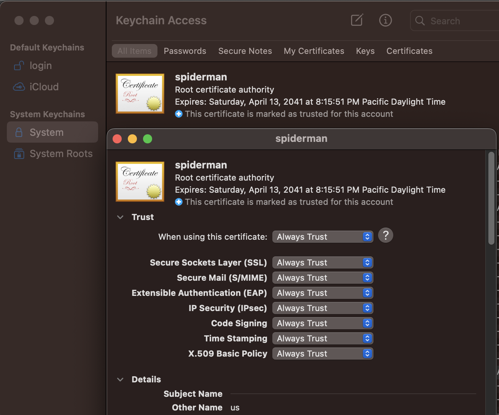

# Ridge API Auto Testing Tool Documentation

## Introduction

## Table of Contents

- [Local Dependency Setup](#local-dependency-setup)
    - [Mac](#mac)
    - [Windows](#windows)

## Local Dependency Setup
## Setup Steps
#### Mac
    1. From RidgeBot download the certificate 
    2. Select **System** in the **Keychain** list, and then select **Add**. Enter your system password to confirm the action.
    3. In Keychain Access, double-click the imported Postman certificate to open it.
    4. Expand the Trust section. Select the option to Always Trust when using this certificate, and make sure Always Trust is selected for Secure Sockets Layer(SSL). 