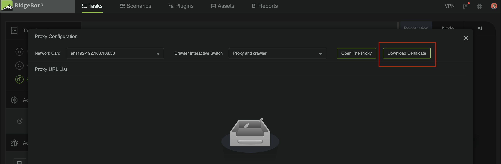

# Ridge API Auto Testing Tool Documentation

## Introduction

This is an inital implementaion of RidgeBot Auto API Testing Tool

## Table of Contents

- [Local Dependency Setup](#local-dependency-setup)
    - [Certificate Setup](#certificate-setup)
        - [Mac](#mac)
        - [Windows](#windows)
- [Runing from Command Line](#running-from-command-line)

## Local Dependency Setup
### Certificate Setup
#### Mac

1. From RidgeBot download the certificate 
    -

2. Select **System** in the **Keychain** list, and then select **Add**. Enter your system password to confirm the action.

3. In Keychain Access, double-click the imported Postman certificate to open it.

4. Expand the Trust section. Select the option to Always Trust when using this certificate, and make sure Always Trust is selected for Secure Sockets Layer(SSL). 
    -


#### Windows

1. From RidgeBot download the certificate 
    -

2. Right-click on the **ca.crt** file and select **Install Certificate**.

3. Select **Local Machine** and select **Next**. This action requires Administrator permissions. Select **Yes** to proceed.

4. Select **Place all certificates in the following store**.

5. Select **Browse** and then select **Trusted Root Certification Authorities**.

6. Select **OK** and then select **Next**.

7. Select Finish to import the **certificate**.

## Running from Command Line

Example of running api_conv.py:

```
python3 api_conv.py api.txt -p 'http://addresss:port' -f 2
```

Note that api_conv.py requires a txt document of curl commands and a proxy server.

For ridgebot the addresss is : 66.220.31.58

The port can be found in the window of the proxy in ridgebot 
    -

See -help for further documentaion